

    <b> Data Science = Solving Problems = Happiness </b>

    <h1> Bike Share USA</h1>

    Denzel S. Williams

    <i>Springboard Data Science Track '20</i>

    
     
    

 
        
<h2> 0. The Inspiration </h2>

From 2013 - 2020 I lived in Melbourne, FL without a car; basically a death sentence. From the very start of those 7 years to the final minute, I pretty much walked to every spot in the 32901/32905 zip code. Grocery stores, check; The Mall, check; College, check; Downtown, check; The Gym, check; Restaurants, check; Barber Shop, check; Places that shouldn't be listed, check. 

 <i><b> Shoutout to any friend that ever gave me a ride to any place ever.</b></i>

The height of my walking took place in the final two years when I was teaching at Palm Bay HS. The public bus to take me to work came ONCE every hour at the "same" inconvenient time. Either getting me to work too early or too late. Even worse the routes were not symmetrical and the bus couldn't take me back home. The only solution was to walk to and from work in the Florida heat everyday for two years. 

<ul>
    <li> Why didn't you buy a car? I was BARELY not a broke college student.
    <li> Ok, why didn't you just get a bicycle? My apartment couldn't accommodate a bike.
    <li> You could've taken Ubers. Have you lost your mind???
</ul>

 <i><b> Shoutout to the trees that gave me the small strip of shade. RIP. </b></i>

Moving back home in 2020, I discovered New York City's bike sharing program, CitiBike, and wished I had this service during my time in Florida. Even better, I am "fortunate" enough to live in a zip code that <b>doesn't</b> have bikes. So out of wishful thinking and and pure jealously, the Bike Share USA project was born. 

<h2> I. Introduction </h2>

Every major human advancement improved how people, things, or ideas moved from one point to another. Ancient innovations such as agriculture, providing us with a surplus of food, enabled us to stop moving and build civilizations. Present day innovations such as the Internet has taken movement to all new levels. Leveraging the internet, you can order a package and have it delivered by day end or you can send software money, permissionlessly, from one end of the world to another. More so, the internet enables the global movement of information at near instant speeds. 

When it comes to the physical transportation of people, intra-planet space travel and self-driving cars are the talk of the town. However, the greatest macro transportation revolution is happening on a micro level.  Micromobility refers to a range of small, lightweight vehicles operating at speeds typically below 15-mph and driven by users personally. Micromobility devices include, bicycles, e-bikes, electric scooters and skateboards, shared bicycles, and electric pedal assisted bicycles <a href="https://en.wikipedia.org/wiki/Micromobility" target="_blank"> [1]</a>. 

 
    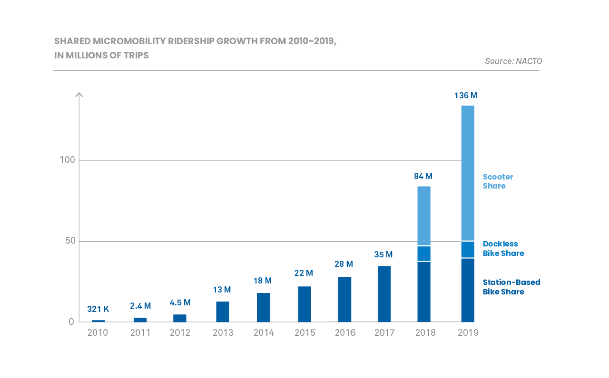
    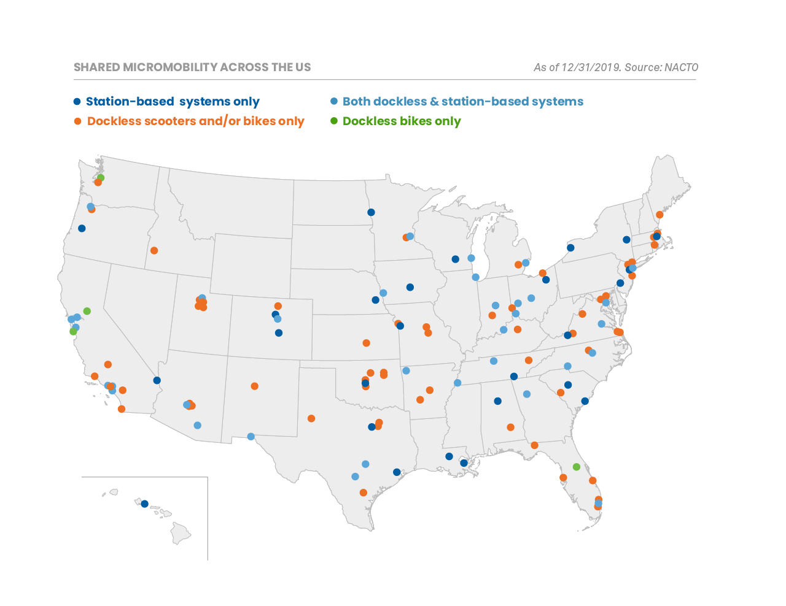
    
 Figure 1. NACTO 2019 Shared Micromobility Report Graphs 

According to the 2019 Shared Micromobility Snapshot, published by the National Association of City Transportation Officials (NACTO), the number of trips taken on shared bicycles, e-bikes, and scooters was 136 million; up 60% from 2018’s 84 million and 288% from 2017’s 35 million <a href="https://nacto.org/shared-micromobility-2019/"> [2]</a>.  Although there is not any official data about transportation mode shifting, their survey data suggests that Micromobility might be replacing car trips. The United States (US) has about 19,495 incorporated cities, towns, and villages and of those, 310 are considered at least medium cities with populations of 100,000 or more <a href="https://worldpopulationreview.com/us-city-rankings/how-many-cities-are-in-the-us"> [3]</a>. Looking at the NACTO map there are only about 130 cities that have micromobility services. Imagine if there were micromobility services in all 310 of those cities. Better yet, imagine every part of the United States having micromobility services and instead of a sparse map the shared micromobility map resembled a Verizon 4G LTE Coverage map. 

 <b>The goal of this project is to expand the station-based bike sharing sector of a State's micromobility services. The idea is to use both zip code and bike sharing data of areas that have stations to build a model that can predict the number of stations that should be built in no-station zip codes. The question that this project is looking to answer is: How many bike sharing stations should be built in the no-station zip codes of States that already have bike stations?</b> 

 <i>The states that are in focus are CA, MA, D.C., MD, VA, NJ, NY, and IL.</i> 
 

<h2> II. Data Wrangling 
     
    
</h2>

The data used to complete the project can be broken into four major groups. The first two groups were fundamental to completing the project and the other half were required for the Exploratory Data Analytics (EDA):

<b> Bike Share Trip Datasets </b>  
The subset of zip codes that have bike stations are derived from the five largest bike sharing services in the US: Bay Wheels, Blue Bike, Capital Bikeshare, Citi Bike, and Divvy Bike. Each company hosts their trip data on S3 buckets for public use. These datasets hold key information about each trip that was taken by their customers. The rows of the datasets represent a single trip; the columns are the properties of the trip such as the starting station and the time when the trip ended. Since the trip data includes the start and end stations, the station data used to make the predictions was derived from these datasets.

<ul>
    <li> Dataset I - <a href="https://s3.amazonaws.com/baywheels-data/index.html"> BayWheels S3 Trip Data Bucket </a>
    <li> Dataset II - <a href="https://s3.amazonaws.com/hubway-data/index.html"> BlueBike S3 Trip Data Bucket </a>
    <li> Dataset III - <a href="https://s3.amazonaws.com/capitalbikeshare-data/index.html"> Capital S3 Trip Data Bucket </a>
    <li> Dataset IV - <a href="https://s3.amazonaws.com/tripdata/index.html"> CitiBike S3 Trip Data Bucket </a>
    <li> Dataset V - <a href="https://divvy-tripdata.s3.amazonaws.com/index.html"> DivvyBike S3 Trip Data Bucket </a>
</ul>

<b> Zip Code Datasets </b>  
All the zip codes of the US along with the properties of the zip code are included in this group. Properties such as the total population, core based statistical area classification, and water area are included. Two supplementary files were used to help fill missing values within the main zip code file. 

<ul>
    <li> Dataset XI - <a href="https://github.com/Williamdst/Bike-Share-USA/blob/main/Data/ZX01_Zipcodes-USA.csv"> Zipcode USA Data </a>
    <li> Dataset XII -<a href="https://www2.census.gov/programs-surveys/metro-micro/geographies/reference-files/2020/delineation-files/list1_2020.xls" > Delineation File </a>
    <li> Dataset XIII -
<a href="https://www.huduser.gov/portal/datasets/usps_crosswalk.html"> USPS Zipcode Crosswalk Files</a>
</ul>

<b> Geospatial Datasets </b>  
New York City (NYC) and San Francisco have geospatial boundaries of their segmented neighborhoods. The datasets in this group contain those geospatial multi-polygons. Additionally, the geospatial locations of the MTA Subway Entrances was gathered for particular analytics section.

<ul>
    <li> Dataset VIII - <a href="https://data.cityofnewyork.us/api/geospatial/yfnk-k7r4?method=export&format=GeoJSON"> NYC Community District GeoJSON File </a>
    <li> Dataset IX - <a href="https://data.sfgov.org/api/geospatial/p5b7-5n3h?method=export&format=GeoJSON"> San Francisco Community District GeoJSON File </a>
    <li> Dataset X - <a href="https://data.cityofnewyork.us/api/geospatial/drex-xx56?method=export&format=GeoJSON"> Subway Entrance GeoJSON File </a>
</ul>

<b> Neighborhood Profile Datasets </b>  
The datasets in this group have the demographics of those segmented neighborhoods. These demographics, when combined with the geospatial data were used to do two custom analyses in the EDA portion of the project. The analysis used both the station location point geometries and the Voronoi polygons of the station locations. 

<ul>
    <li> Dataset VI - <a href = "https://furmancenter.org/neighborhoods"> New York City Neighborhood Profiles </a>
    <li> Dataset VII - <a href = "https://default.sfplanning.org/publications_reports/SF_NGBD_SocioEconomic_Profiles/2012-2016_ACS_Profile_Neighborhoods_Final.pdf"> San Francisco Neighborhood Profiles </a>
</ul>

<h2> III. The Database
    
    
    

</h2>

All the datasets summed to over 68 GB of data across 350+ files. To work with this data, the best course of action was to build a database. Leveraging the Amazon Web Services (AWS) Cloud a RDS Database running PostgreSQL 12.5 was created on a db.t3.micro instance. With the blank database created, before doing anything, it was important to think about how the data was going to be used for analytics; to determine how it should be feed into the database. With that idea in mind an Entity Relationship Diagram (ERD) was created to structure the database and guide the transformation portion of the upcoming Extract Transform and Load (ETL) jobs. 

    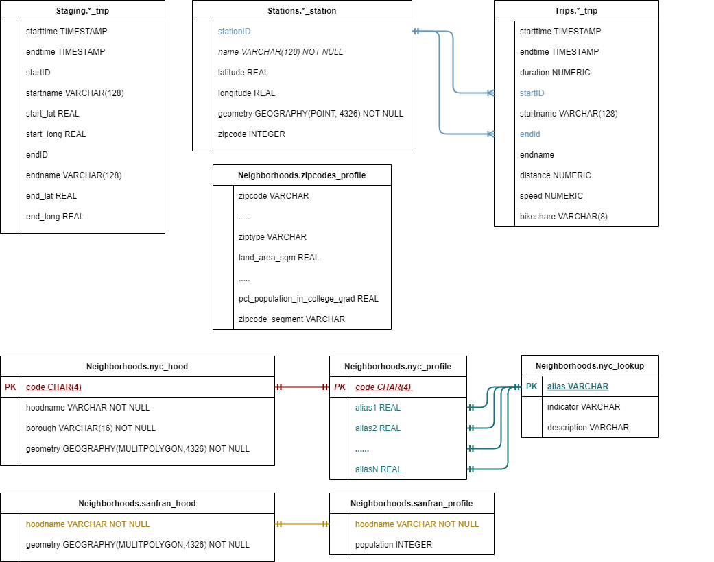
    
 Figure 2. Entity Relationship Diagram of the Database 

<h2> IV. Exploratory Data Analytics 
    
    
</h2>

 <i>The full EDA can be found in the BSU-Report. Shown below are samples from the project. </i> 

<h3> Inter Zip Code Travel </h3>

The significance of this project is to guide a bike share company's expansion into new areas. For an expansion into a new area, it is important to expand into multiple zip codes in a region, but the ultimate question is <b>how many</b>. To get an idea of how things should be done, the number of zip codes the stations were spread across when the five services made their inital launches was determined. Additionally, the number of zip codes the stations were in at the end of 2020 was determined. 

    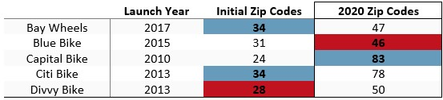
    
 Table 1. The initial number of zip codes a bike sharing service launched in and the current number of zip codes it covers. 

<h3> How Many People Does Each Station Serve? </h3>

When people use public transportation they go to the spot that is most convenient for them. Typically, convenient means the closet. I say typically because there are times when people have to go farther distances to catch a bus or train because the route of the bus/train is more convenient for where they are headed. However, in the case of bike share, there is no incentive to go to a bike station that is farther away from the one that is closet to you. Therefore a station only serves the people that are closer to it than to any other station. The number of people a station serves is defined by the equation:

     

where  is the number of people served by station ,  is the number of neighborhoods in the region (NYC or San Francisco),  is the area function,  is the geometry polygon for neighborhood ,  is the voronoi polygon for station ,  is the population for neighborhood . 

 <b><i>A Simple Interpretation of the Formula: It's multiplying the portion of a station's voronoi polygon that is in a neighborhood by the population density of that neighborhood.</i></b>

    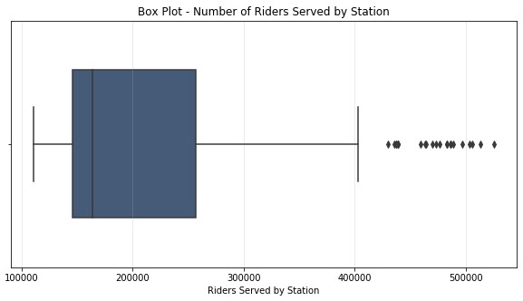
    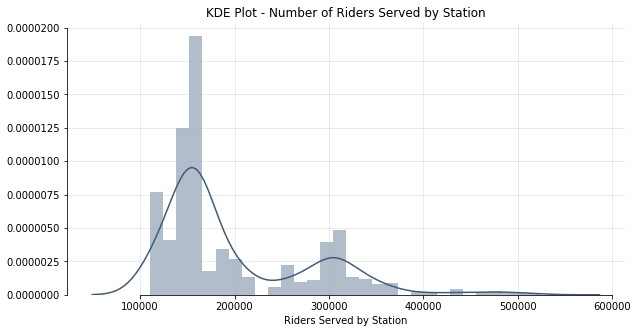
    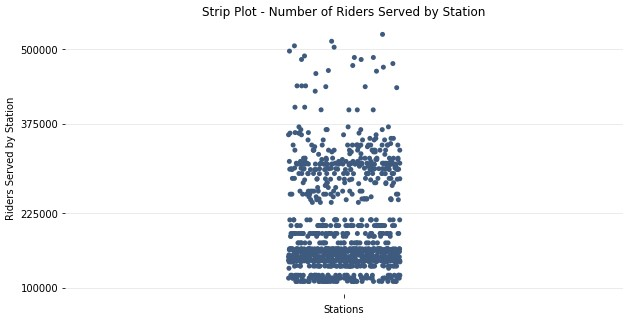
    

    
 Figure 3. Different visulizations of the number of people served by bike stations in New York City. 

Each of the three graphs above show the number of riders served by stations in NYC. They reveal that majority of stations, about 75%, serve between 100K and 225K people. There is a smaller group that serve between 225K and 350K people. Although the people served statistic is interesting, it isn't very useful on in its own. It's impossible to tell if a station with a higher statistic has a bigger voronoi area or has a smaller voronoi area in a denser part of the city. A better statistic to look at would be the ratio between the riders served and the area of the voronoi. The graphs of the ratios for both cities are shown in the graphs below:

    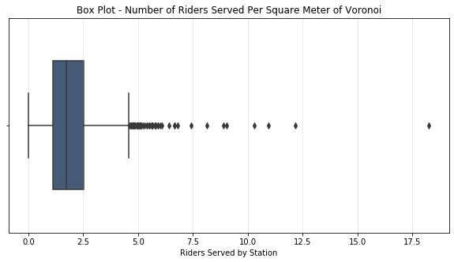
    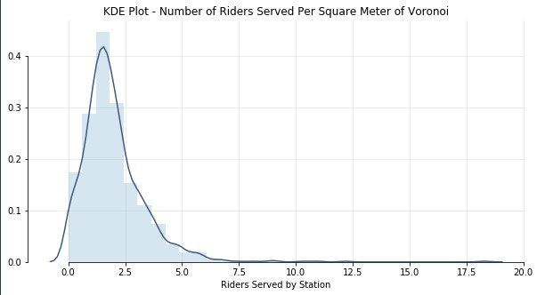
    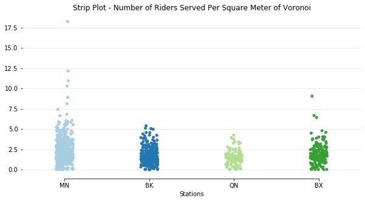
    

    
 Figure 4. Different visualizations of the <b> ratio </b> between people served and the voronoi area of stations in New York City

Looking at just riders served, the data was really spread out, the data is much tighter when looking at the ratio between the riders served and the area of the voronoi. Regardless of the borough, regardless of the location, the number of people that a station serves in NYC is rarely over 3.5 people per square meter of it's voronoi polygon. Which makes practical sense because the denser the population of an area the more stations you need to accomodate the population. The more stations packed into one area, the smaller the voronoi area. Although the area is small, it is still serving tons of people. Population density may be an extremely important factor when a company chooses the number of; and the locations of stations in a potential expansion area. 

<h3>Would You Have Bike Access?</h3>

With an understanding of how many people each station serves the next question to ask is: would you even be served to begin with? What is the probability that a randomly selected New Yorker or San Franciscan lives within a certain distance of a station? This question is asking about the <b>accessibility</b> of the overall network of stations. How many people in the city have the OPTION of using bike sharing if they wanted it. When looking to expand into a new area a good goal to shoot for is to distribute stations in a way that allows ~80% of people to reach a station within 10 minutes.

    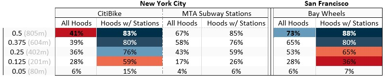
    
 Table 2. The percentages of people that live within a certain distance of a bike sharing station. 

<h2>V. Zip Code Station Predictions
    
    
</h2>

 <i>The full Machine Learning can be found in the BSU-Report. Shown below are the model evaluations and the model selection + predictions. </i> 

To predict the number of stations that should be in a given zip code, a count of the known number of active stations that exist in the handful of zip codes that are in the five sharing services are taken. Using the zip code features from the zipcodes_profile table in the database, this count will be the target value in our supervised learning regression problem. After the model is trained a pipeline will be built to take in the information that for all the zipcodes that don't already have bike stations.   

Five models were used in the training and the results of each model can be seen in the table below. Leveraging the AWS cloud via Sagemaker, the instance type was able to be scaled to hypertune all the models. The tuning was done using TuneSearchCV with hyperopt search optimization and RepeatedKFolding using the default settings (<i>10 repeats of 5 folding</i>). 

    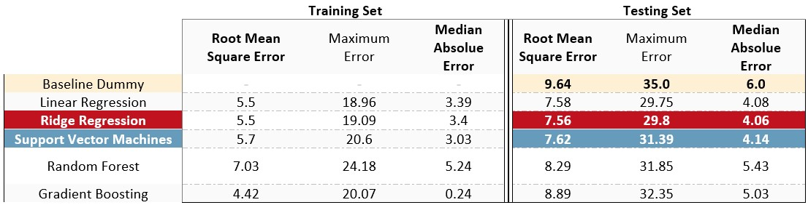
    
 Table 3. The training/testing results for the model candidates used in the project 

The Ridge Regression model is chosen as the final model used to make the decision, but the support vector model was also used to make predictions. Two identical pipelines were built minus the final step which used only one of the two models as the predictor. The data that gets fed into the pipeline is the original zipcode data with the "all-zip code" mean shift clustering. The pipeline steps are shown in the figure below:
    

    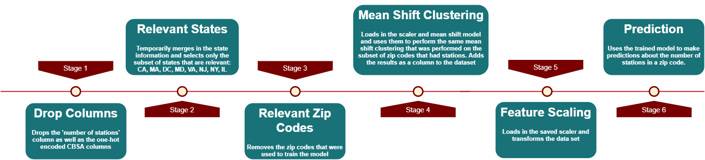
    
 Figure 5. A visual representation of the pipeline 

    
The models predicted very similar results. Both mainly predicting 0 stations for the majority of zip codes (7700+ out of 9492) and had maximum predictions of about 25. The high number of 0 predictions isn't very suprising being that all the bike sharing services are located in the largest cities of the country (by population). My guess is that the farther a zip code is away from the heart of the city the less stations they get and at some point they shouldn't get any. Bike Sharing isn't suited for areas where a long journey is the norm and a car is really the only appropriate form of transportation. Imagine riding a bike 10 miles to the supermarket (25m BY CAR) and there are no more bikes when you try to go home. Without the other transportation options that urban areas offer, you would have to walk that 10 miles, groceries in hand.
    

    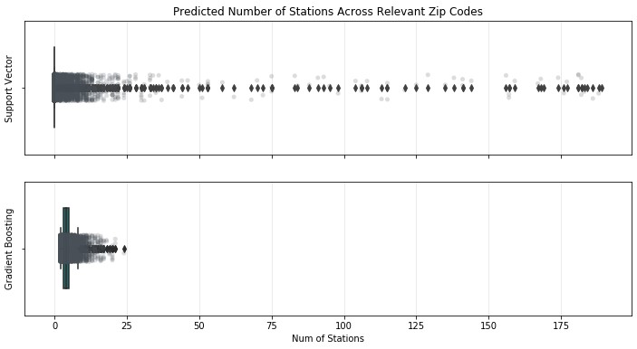
    
 Figure 6. The number of stations predicted in different zip codes 

 <b> Dear CitiBike, even with all the zeros that the model predicted, 15 stations were recommended for the zip code where I live. Maybe one day you could do an expansion into my area. One spot I recommend is outside my house. </b> 
 
